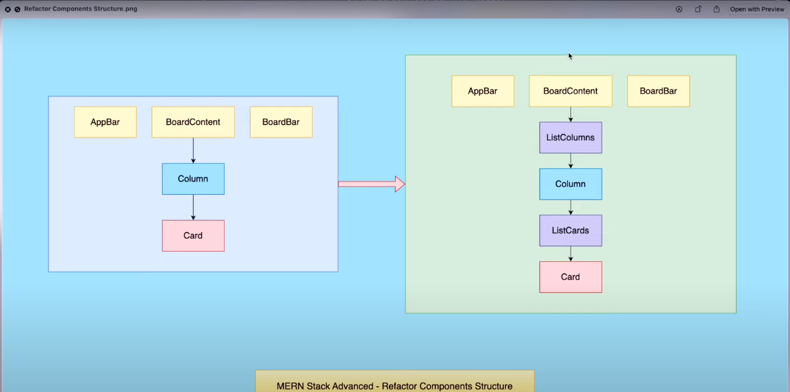

# Bộ code base để bắt đầu học khóa MERN Stack Pro - Lập Trình qua dự án thực tế Trello Clone trên YouTube của Trung Quan Dev nhé các bạn!

Some images in the project



## Base project for my MERN Stack Pro Course - Build Trello App on YouTube!

- Link YouTube Playlist: [Link YouTube](https://by.tn/yeNZ)

### Requirements - Thông tin của bộ Code Base này - Chuẩn các phiên bản dưới đây để bắt đầu học: (Semantic Versioning)

```
* nodejs = v18.16.0
* npm = v9.5.1
* yarn = v1.22.19

* "react": "^18.2.0"
* "react-dom": "^18.2.0"
* "@types/react": "^18.0.28"
* "@types/react-dom": "^18.0.11"

* "vite": "^4.3.2"
* "@vitejs/plugin-react-swc": "^3.0.0"

* "eslint": "^8.38.0"
* "eslint-plugin-react": "^7.32.2"
* "eslint-plugin-react-hooks": "^4.6.0"
* "eslint-plugin-react-refresh": "^0.3.4"
```

### About Me - Thông tin về mình:

Author: **Duynghiadev - Một Lập Trình Viên**

Blog: updating...

CV: updating...

"Learning new everyday not the copycat of yesterday!"

"A bit of fragrance clings to the hand that gives flowers!"

Thanks for watching!
